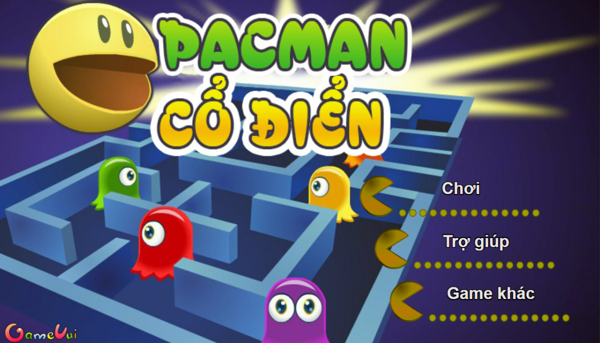
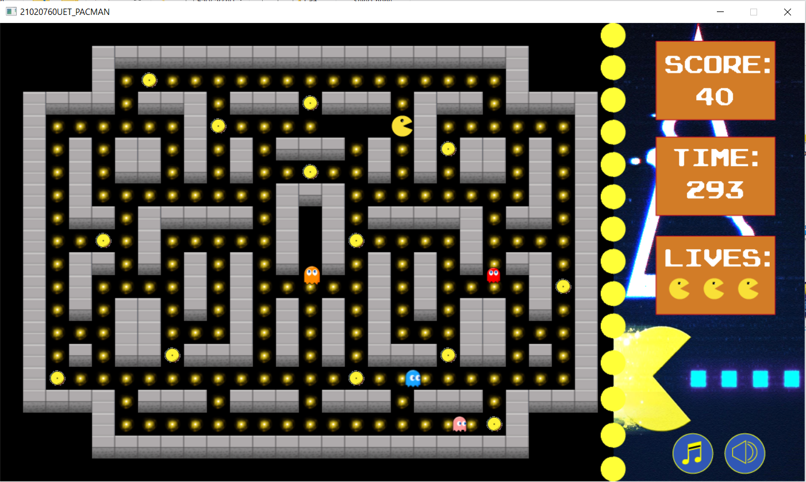
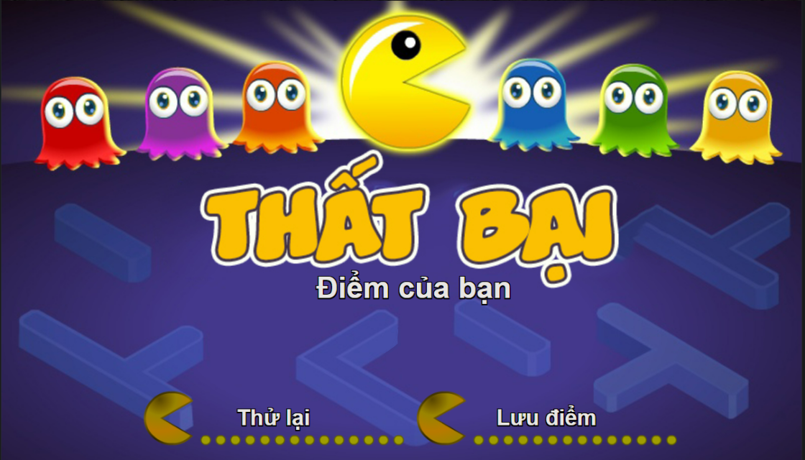
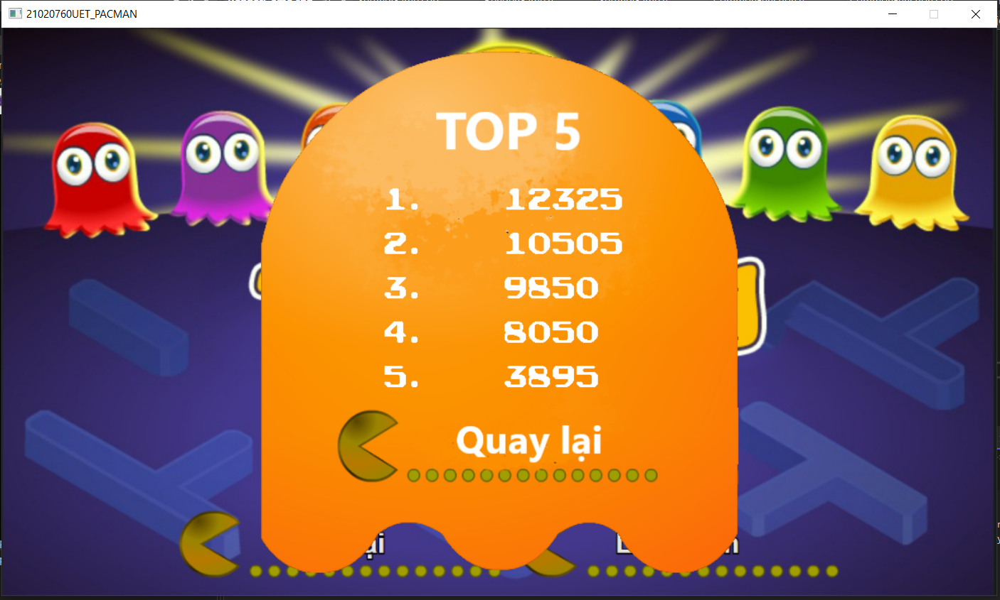

# ***Pacman Game***
## **Introduction**
+ Bài tập lớn - Pacman (INT2215 1 - Lập trình nâng cao)

+ Mã sinh viên:  21020760 - Nguyễn Hữu Đồng - K66CB - UET

+ Video demo: https://www.youtube.com/watch?v=O2MJ70ml4O4
## **Description**

### *Entities*

-  ***Pacman*** là nhân vật chính của trò chơi. ***Pacman*** có thể di chuyển theo 4 hướng trái/phải/lên/xuống theo sự điều khiển của người chơi.

-  ***pac dot*** là các đối tượng mà ***Pacman*** phải ăn hết trước thời gian định sẵn để có thể qua level.
-  ***big pac dot*** tương tự như ***pac dot*** nhưng được nhiều điểm hơn.

-  ***pac pac*** là đối tượng mà ***Pacman*** phải tránh, nếu va phải sẽ bị mất đi 1 điểm sinh mạng.

-  ***Brick*** là đối tượng mà cả ***Pacman*** hay ***Pac pac*** đều không thể đi qua.

### *Game play, collision and explosion*

- Trong một màn chơi, ***Pacman*** sẽ được người chơi di chuyển để có thể ăn hết tất cả các ***Pac dot*** và ***Big pac dot*** trong thời gian quy định (5 phút), đồng thời phải tránh va chạm với ***Pac pac***.

- ***Pacman*** sẽ mất 1 mạng khi va chạm với ***Pac pac***. Khi ***Pacman*** hết sinh mạng, trò chơi sẽ kết thúc. Mỗi vòng chơi, ***Pacman*** có tối đa là 3 mạng.

- Càng về các màn sau, càng xuất hiện nhiều góc chết hơn, hãy khéo léo điều khiển ***Pacman*** của bạn 1 cách thông minh nhất có thể.

- Thời gian trong game cũng tương đối ngắn, hãy để ý và không để lãng phí 1 chút thời gian nào.

- Độ khó của game cũng được phân chia thành 4 mức độ:
  - Mức 1 (Easy): Với mức độ chơi này, tất cả các con ***Pac pac*** đều di chuyển 1 cách ngẫu nhiên, không có quy luật nào.

  - Mức 2 (Normal): Ở mức kế tiếp, đôi khi những con ***Pac pac*** có thể xác định được vị trí của người chơi và đuổi theo, tuy nhiên điều đó chỉ xảy ra trong thời gian ngắn và ngắt quãng.

  - Mức 3 (Hard): Cấp độ chơi này, những con ***Pac pac*** sẽ đuổi theo bạn thường xuyên hơn so với mức độ 2.

  - Mức 4 (Very hard): Ở mức độ cuối cùng, những con ***Pac pac*** sẽ liên tục tìm và đuổi theo bạn nhiều nhất, nhanh nhất và tối ưu nhất có thể, chúng có thể đuổi theo liên tục hoặc chặn cả 2 đầu lối đi nhân vật của bạn.

### *Controls and Options*

| Control | Key 1 | Key 2 |
|---------|-------|-------|
| UP      | W     | ↑     |
| DOWN    | S     | ↓     |
| LEFT    | A     | ←     |
| RIGHT   | D     | →     |

| Option   | Key       |
|----------|-----------|
| New Game | Ctrl + N  |
| Pause    | Ctrl + P  |
| Resume   | Ctrl + R  |

### *Preview*

## **Setup**

- *Cài đặt*
  1. Truy cập vào đường link: https://drive.google.com/drive/folders/1yQ5hY6p6sfGV5CA64lJfIAHfQSacvjKH?usp=sharing, tải xuống file **"Release"**.

  2. Giải nén file vừa tải về.

  3. Vào Release -> setup.exe. Sau đó cài đặt theo hướng dẫn của chương trình.

  4. Nhấn close, thoát ra màn hình chính, ấn đúp chuột vào icon pacman để bắt đầu chơi.

- *Gỡ bỏ*
  1. Vào control panel.

  2. Tìm kiếm Uinstall a program.

  3. Ấn đúp chuột vào file Pacman_21020760UET.

  4. Ấn "Yes" nếu chắc chắn bạn muốn gỡ bỏ chương trình.

- *Trong trường hợp xuất hiện lỗi "The code execution cannot proceed because ....dll was not found. Reinstalling the program may fix this problem.":*

  1. Truy cập vào đường link ở trên, tải về file **"System32"** và **"SysWOW64"**.

  2. Giải nén file vừa tải về.

  3. Copy file .dll  trong file **"System32"** dán vào trong thư mục **"C:\Windows\System32"** .

  4. Copy file .dll  trong file **"SysWOW64"** dán vào trong thư mục **"C:\Windows\SysWOW64"**.

  5. Thoát ra ngoài và chạy lại chương trình.

- *Mọi khó khăn trong việc cài đặt, trong quá trình chơi, hay gỡ bỏ, hãy email qua 21020760@vnu.edu.vn.*

## **See also**
### *Các kĩ thuật sử dụng*

- Thư viện SDL2.0.

- Tìm hiểu lập trình hướng đối tượng.

- Kĩ thuật đọc ghi file.

- Kĩ thuật chia file header và file source.

- Kĩ thuật tile map, fps ...

- Tạo các đối tượng: nhân vật với tính năng như xử lí sự kiện, va chạm, ...

- Tạo các đối tượng phụ: thời gian, điểm, sinh mạng,...

- Tạo âm thanh, effect,... (có thể bật hoặc tắt bất cứ lúc nào).

- Tạo các menu: Bắt đầu, kết thúc, cài đặt, chơi lại, hướng dẫn,...

- Liên kết với các đường link ngoài.

- Lưu lại điểm số (kể cả chương trình có bị đóng lại).

- Tạo bảng xếp hạng.

- Đóng gói chương trình để có thể cài đặt, chơi được ở các máy tính thông thường.

### *Kết luận, điều tâm đắc*

- Làm quen với lập trình hướng đối tượng.

- Có thêm kĩ năng tìm hiểu thông tin và cập nhật kiến thức mới.

- Có kiến thức về lập trình hướng đối tượng.

- Sáng tạo thuật toán để game có điểm riêng hơn so với các game tương tự.

### *Hướng phát triển*

- Làm game online đưa lên cho tất cả mọi người cùng chơi và sắp xếp điểm cho mọi người.

- Sử dụng thêm nhiều thuật toán cho nhân vật di chuyển đa dạng hơn.

- Trau chuốt hơn về âm thanh, hình ảnh.

- Code rõ ràng, gọn gàng, đúng cấu trúc hơn.

### *Nguồn tham khảo:*
- https://lazyfoo.net/tutorials/SDL/index.php (các hàm trong thư viện SDL2.0, ...)

- https://phattrienphanmem123az.com/lap-trinh-game-c-p2 (kĩ thuật lập trình hướng đối tượng, tile map, fps, ...).

- https://gamevui.vn/pacman-co-dien/game (hình ảnh, âm thanh game,...).

- https://www.kindpng.com/imgv/TJoimTR_pacman-sprite-png-transparent-background-pacman-sprite-png/ (hình ảnh của game).

### *Mức điểm tự đánh giá: 9.5/10.*
